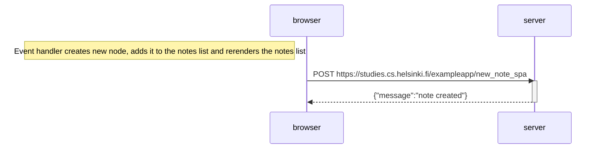

```mermaid
sequenceDiagram
participant browser
    participant server
    Note left of browser: Event handler creates new node, adds it to the notes list and rerenders the notes list
    browser->>server: POST https://studies.cs.helsinki.fi/exampleapp/new_note_spa
    activate server
    server-->>browser: {"message":"note created"}
    deactivate server

   
```